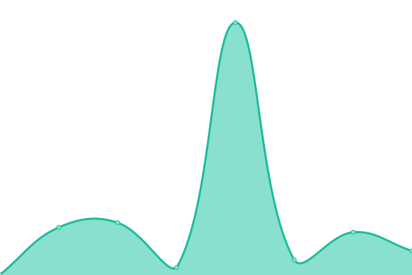

# [📈 Live Status](https://aymeric35.github.io/websites-monitoring): <!--live status--> **🟩 All systems operational**

This repository contains the open-source uptime monitor and status page for [Aymeric](https://aymeric35.github.io/websites-monitoring), powered by [Upptime](https://github.com/upptime/upptime).

With [Upptime](https://upptime.js.org), you can get your own unlimited and free uptime monitor and status page, powered entirely by a GitHub repository. We use [Issues](https://github.com/aymeric35/websites-monitoring/issues) as incident reports, [Actions](https://github.com/aymeric35/websites-monitoring/actions) as uptime monitors, and [Pages](https://aymeric35.github.io/websites-monitoring) for the status page.

<!--start: status pages-->
<!-- This summary is generated by Upptime (https://github.com/upptime/upptime) -->
<!-- Do not edit this manually, your changes will be overwritten -->
<!-- prettier-ignore -->
| URL | Status | History | Response Time | Uptime |
| --- | ------ | ------- | ------------- | ------ |
|  Mon site web | 🟩 Up | [mon-site-web.yml](https://github.com/aymeric35/websites-monitoring/commits/HEAD/history/mon-site-web.yml) | 

 590ms
     
 | 

<a href="https://aymeric35.github.io/websites-monitoring/history/mon-site-web">100.00%</a>
    

|  ACDS | 🟩 Up | [acds.yml](https://github.com/aymeric35/websites-monitoring/commits/HEAD/history/acds.yml) | 

 1131ms
     
 | 

<a href="https://aymeric35.github.io/websites-monitoring/history/acds">99.30%</a>
    

|  Hervé Maréchalerie | 🟩 Up | [herve-marechalerie.yml](https://github.com/aymeric35/websites-monitoring/commits/HEAD/history/herve-marechalerie.yml) | 

 1182ms
     
 | 

<a href="https://aymeric35.github.io/websites-monitoring/history/herve-marechalerie">98.89%</a>
    

|  Pizza restaurant | 🟩 Up | [pizza-restaurant.yml](https://github.com/aymeric35/websites-monitoring/commits/HEAD/history/pizza-restaurant.yml) | 

 1000ms
     
 | 

<a href="https://aymeric35.github.io/websites-monitoring/history/pizza-restaurant">100.00%</a>
    

<!--end: status pages-->

[**Visit our status website →**](https://aymeric35.github.io/websites-monitoring)

## 📄 License

- Powered by: [Upptime](https://github.com/upptime/upptime)
- Code: [MIT](./LICENSE) © [Aymeric](https://aymeric35.github.io/websites-monitoring)
- Data in the `./history` directory: [Open Database License](https://opendatacommons.org/licenses/odbl/1-0/)
